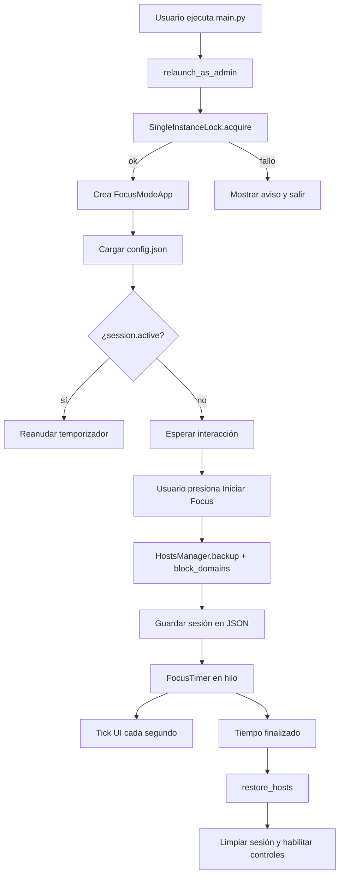
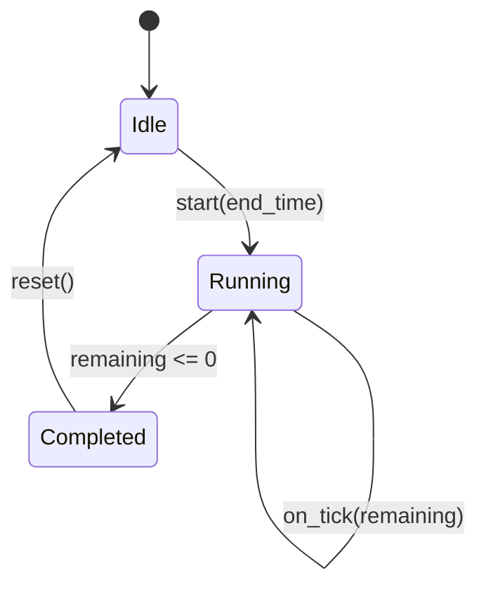
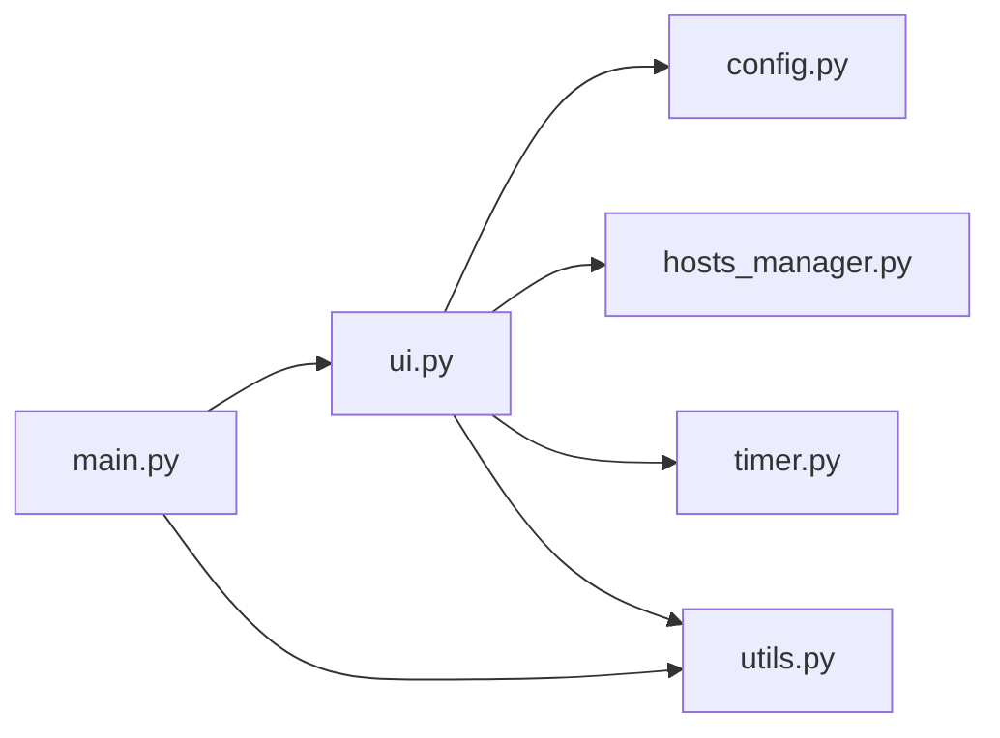

# INSTRUCCIONES TÉCNICAS – FOCUS MODE

## 1) Objetivo técnico

Focus Mode implementa un bloqueo **real** de dominios web en Windows mediante modificación controlada del archivo `HOSTS`, manteniendo una UI responsiva y persistencia de estado para recuperar sesiones activas incluso después de reinicio del sistema.

---

## 2) Arquitectura elegida y por qué

Se eligió una arquitectura modular por responsabilidades:

- `main.py` → orquestación de arranque.
- `ui.py` → interacción con usuario y flujo de sesión.
- `hosts_manager.py` → acceso seguro al HOSTS.
- `timer.py` → reloj de cuenta regresiva sin bloquear UI.
- `config.py` → persistencia JSON tipada.
- `utils.py` → capacidades transversales (admin, lock, logging).

### Justificación

1. **Separación de responsabilidades**: cada módulo hace una cosa.
2. **Mantenibilidad**: cambios futuros afectan menos archivos.
3. **Testabilidad**: lógica de temporizador/hosts/config puede validarse de forma aislada.
4. **Robustez**: la capa de hosts encapsula respaldo y restauración.

---

## 3) Patrón de diseño aplicado

Se usa un enfoque de **Service + Coordinator**:

- Servicios: `ConfigManager`, `HostsManager`, `FocusTimer`.
- Coordinador: `FocusModeApp` (UI) decide cuándo invocar cada servicio.

No se introduce complejidad innecesaria (como frameworks de DI) para mantener el proyecto simple y productivo.

---

## 4) Flujo completo de ejecución



---

## 5) Responsabilidad detallada por archivo

## `main.py`

- Solicita elevación UAC (`relaunch_as_admin`).
- Evita segunda instancia simultánea (`SingleInstanceLock`).
- Crea servicios y arranca la UI.

## `config.py`

- Define `FocusConfig` y `FocusSession` con `dataclass`.
- Guarda/lee `%APPDATA%\FocusMode\config.json`.
- Recupera defaults si JSON está corrupto.
- Convierte fechas ISO (`now_iso`, `parse_iso`).

## `hosts_manager.py`

- Calcula variantes de dominio:
  - `dominio.com`
  - `www.dominio.com`
  - `m.dominio.com`
- Crea respaldo antes de escribir.
- Inserta sección delimitada por marcadores Focus.
- Si algo falla al escribir, restaura backup.
- Al terminar sesión, restaura exactamente desde backup.

## `timer.py`

- `FocusTimer.start(...)` lanza un hilo `daemon`.
- Calcula segundos restantes y reporta `on_tick` cada segundo.
- Invoca `on_complete` al llegar a cero.
- `format_seconds` formatea `HH:MM:SS`.

## `ui.py`

- Construye interfaz moderna CustomTkinter, tema oscuro.
- Permite alta/baja de dominios desde la GUI.
- Permite duración predefinida y personalizada.
- Inicia sesión focus sin ofrecer botones de cancelación.
- Intercepta cierre de ventana durante sesión activa.
- Reanuda sesión persistida automáticamente.
- En modo estricto, registra intentos de cierre.

## `utils.py`

- `is_admin` / `relaunch_as_admin` (UAC).
- `SingleInstanceLock` para evitar dos procesos activos.
- `append_strict_log` para auditoría de cierres bloqueados.

---

## 6) Temporizador y concurrencia

¿Por qué `threading`?

- Tkinter/CustomTkinter usan un loop principal de UI (single-threaded).
- Si el contador corriera en el hilo principal, la interfaz se congelaría.
- Con un hilo dedicado, la UI permanece fluida.

### Ciclo del temporizador



La actualización visual se hace con `self.after(...)`, que transfiere el update al hilo principal de la UI de forma segura.

---

## 7) Persistencia y recuperación tras reinicio

Se guarda en JSON:

- `blocked_sites`
- `last_duration_seconds`
- `strict_mode`
- `session.active`
- `session.start_time`
- `session.end_time`
- `session.duration_seconds`

Al abrir la app:

1. Se carga el JSON.
2. Si `session.active == true` y `end_time > now`, se relanza el temporizador con el tiempo restante.
3. Si `end_time <= now`, se fuerza la ruta de finalización para restaurar HOSTS y limpiar estado.

---

## 8) Cómo se modifica y restaura HOSTS

1. Leer contenido actual de HOSTS.
2. Guardar backup (`.focusmode.bak`).
3. Construir bloque Focus con variantes de dominios.
4. Escribir HOSTS actualizado.
5. Si hay excepción de escritura, restaurar inmediatamente.

Restauración:

- Preferentemente desde backup (restauración exacta).
- Fallback: elimina sección delimitada por marcadores Focus.

---

## 9) Manejo de errores y seguridad

- Si falla activación de bloqueo, se intenta restaurar HOSTS.
- Si el JSON está inválido, se regenera configuración por defecto.
- Se evita dejar HOSTS en estado inconsistente con backup/restore.
- No se almacenan secretos.

---

## 10) Evitar cierres accidentales

Cuando hay sesión activa y usuario cierra ventana:

- Se muestra aviso obligatorio:
  - “El modo Focus está activo. No puedes cerrar la aplicación hasta que finalice el temporizador.”
- Se cancela cierre.
- En modo estricto, además:
  - se registra evento en `strict_mode.log`
  - la ventana se minimiza (`iconify`) en vez de cerrarse.

---

## 11) Evitar segunda instancia

`SingleInstanceLock` crea/abre un lockfile en `%APPDATA%\FocusMode\focusmode.lock` y aplica lock no bloqueante.

- Si lock ya existe por otro proceso activo, la nueva instancia muestra aviso y termina.
- Evita condiciones de carrera sobre HOSTS y estado de sesión.

---

## 12) Librerías utilizadas

## `customtkinter`

- **Qué hace**: Widgets modernos sobre Tkinter.
- **Por qué**: look profesional, dark mode, componentes consistentes.
- **Alternativas**: Tkinter clásico, PySide6, PyQt.
- **Ejemplo**:

```python
button = ctk.CTkButton(parent, text="Iniciar", command=handler)
```

## `pathlib`

- **Qué hace**: manipulación orientada a objetos de rutas.
- **Por qué vs `os.path`**: API más legible, menos errores por separadores.
- **Alternativas**: `os.path`.
- **Ejemplo**:

```python
config_path = Path.home() / "AppData" / "Roaming" / "FocusMode" / "config.json"
```

## `json`

- **Qué hace**: serializar/deserializar configuración.
- **Por qué**: formato simple, humano-legible, estándar.
- **Alternativas**: SQLite, TOML, YAML.

## `threading`

- **Qué hace**: ejecutar temporizador en segundo plano.
- **Por qué**: no bloquear renderizado de UI.
- **Sin esto**: la ventana se congela durante la cuenta regresiva.

## `subprocess`

- **Rol esperado**: extensión futura para integraciones de sistema.
- **Nota**: la versión actual no lo necesita para el flujo principal.

## `ctypes`

- **Qué hace**: llamar API de Windows (`IsUserAnAdmin`, `ShellExecuteW`).
- **Por qué**: UAC automático para escribir en HOSTS.
- **Alternativas**: scripts externos o manifest, con menos control en runtime.

## `tkinter.messagebox`

- **Qué hace**: mensajes de aviso/error/confirmación.
- **Por qué**: feedback claro al usuario en eventos críticos.

---

## 13) Relación entre módulos



---

## 14) Ejemplo de flujo interno al iniciar Focus

1. Usuario pulsa **Iniciar Focus**.
2. UI valida que haya sitios.
3. UI calcula duración y `end_time`.
4. UI persiste sesión activa en memoria.
5. `HostsManager.block_domains(...)` respalda y escribe HOSTS.
6. Config se guarda a JSON.
7. `FocusTimer.start(...)` inicia ticks.
8. UI muestra `HH:MM:SS` hasta terminar.
9. Al completar: restore HOSTS + limpieza de sesión.

---

## 15) Límites técnicos del “Extra”

- “Restaurar automáticamente ventana si se mata desde Task Manager” no es garantizable de forma robusta sin componentes adicionales (servicio watchdog externo o driver/servicio del sistema).
- Se implementó la parte viable en app desktop estándar: bloqueo de cierre, minimización y logging.

---

## 16) Siguientes mejoras sugeridas

- Integrar bandeja del sistema real (`pystray`) para UX completa de modo estricto.
- Añadir firma digital del ejecutable para experiencia UAC más confiable.
- Añadir pruebas unitarias para parser de config y escritura de HOSTS en entorno temporal.
- Añadir internacionalización (`es/en`) y perfiles de estudio predefinidos.
